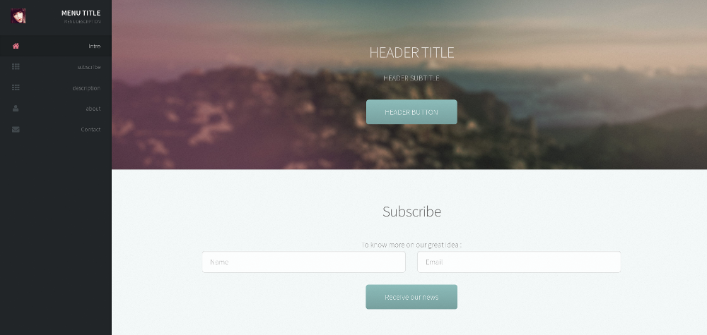

# Landing Template

A generic [Hugo](https://gohugo.io/) landing page based on the [Prologue](https://themes.gohugo.io/theme/prologue/) theme, to quickly tests ideas.

- All titles, description, footer, form prefix... are in the config
- Integrates the [netlify](https://www.netlify.com/docs/form-handling/) forms for subscription and contact.
- Uses layouts/index.html and perso.css
- Removes the gallery.

## Images

In `static/images`, put
- 'avatar.jpg' : image at the top left
- 'banner.jpg' : image at the top
- 'about.jpg' : image at the middle

## License

This theme is released under the CC BY 3.0 license. For more information, read the [License](https://github.com/sethmacleod/prologue/blob/master/LICENSE.md).
